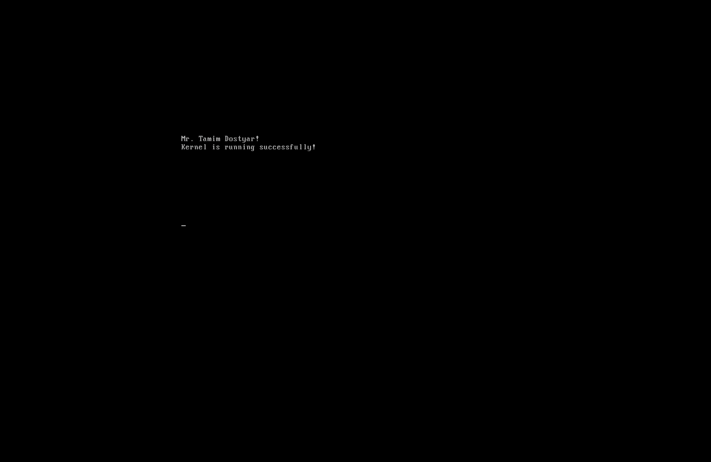
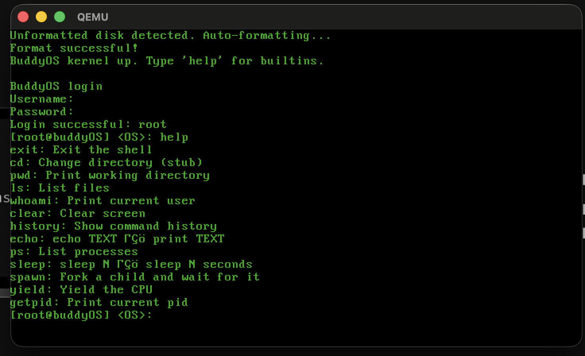

# BuddyOS
<p align="center">
  
</p>




Educational implementations of core operating-system concepts in **C** for **BuddyOS** — an OS built from scratch. The repository is organized as milestones that build the OS in dependency order (boot path, kernel memory, process scheduling, file system, system calls, and shell). A minimal **cross-compiler / emulator** setup (for example QEMU) is only a development convenience, not a dependency on a full desktop OS as the runtime.

> **Status:** the minimal system is complete and runnable. It boots in QEMU,
> drops into a shell, and supports preemptive multitasking, fork/wait, and a
> small set of syscalls. See **[Status](#status)** below for what is and isn't
> implemented.
>
> **About the author:** I'm new to OS development — this is a learning
> project, not a production kernel. Expect rough edges (no Ring 3 split yet,
> no paging, no real disk driver). Feedback / PRs welcome.

## Status

What works today (verified by booting in `qemu-system-i386`):

- Bootloader → 32-bit protected mode → kernel at `0x1000`
- IDT with all 32 CPU exception handlers (panic prints vector, error code, all GPRs, EIP, CR2 on #PF)
- PIC remap, PIT @ 100 Hz, PS/2 keyboard
- Kernel heap (`kmalloc`/`kfree`)
- Preemptive round-robin scheduler with real context switching (`scheduling/src/switch.s`)
- `task_create` / `task_fork` / `task_exit` / `task_wait` (kernel-thread model)
- Syscall dispatcher reachable via direct call **and** `int 0x80` — currently used through the direct path
- Shell with builtins: `help`, `echo`, `ps`, `sleep`, `spawn`, `yield`, `getpid`, `ls`, `clear`, `whoami`, `history`, `exit`
- In-memory FS skeleton (auto-formats on first boot)
- Login (`root` / `buddy`)

What's deliberately **not** done yet:

- TSS + Ring 3 separation (everything runs in Ring 0; the syscall layer is
  designed so user code can switch to `int 0x80` later without changing the
  dispatcher)
- Paging / per-process address spaces
- ATA disk driver — FS lives in a RAM array
- ELF loading — the shell is linked into the kernel image

## Objectives

- Implement and exercise the same ideas covered in typical OS coursework: execution, heap layout, synchronization, on-disk structure, and the user–kernel boundary—**on BuddyOS**.
- Produce code that can be built, tested, and demonstrated per milestone as BuddyOS grows.
- Keep specifications, checklists, and notes alongside the code in version control.

## Scope

Milestones are defined for **BuddyOS** and intentionally avoid assuming prebuilt kernel subsystems. You implement each layer progressively: bring-up first, then kernel memory, process execution, storage, user-kernel interface, and finally user-facing applications.

## Milestones

| Order | Focus | Summary | Status |
|------:|--------|---------|--------|
| 1 | Bootloader + Kernel | Bootloader load path, protected mode, VGA text, keyboard interrupt | done |
| 2 | Kernel Allocator | `kmalloc`/`kfree`, free list, coalescing, alignment | done |
| 3 | Process Scheduler | PCB lifecycle, context switching, round-robin, `fork`/`wait`/`exit` | done (kernel threads; no Ring 3 yet) |
| 4 | File System | Virtual disk, bitmap, inodes, directories, file operations | partial — RAM-backed, no real disk |
| 5 | System Calls | User–kernel boundary, syscall table, user wrappers | done (dispatcher; `int 0x80` wired but unused while everything runs Ring 0) |
| 6 | Shell | Built-ins, command execution, pipelines | builtins + fork/wait demo done; pipelines / redirection not yet |

Detailed requirements and acceptance criteria for each milestone are under `docs/`.

## Repository layout

```
boot/          Bootloader and early boot assembly
kernel/        Core kernel code (bring-up, memory, scheduler, syscalls)
fs/            File-system implementation details (can later merge under kernel/fs)
alloc/         Kernel allocator experiments/notes (can later merge under kernel/mm)
userspace/     User-mode programs and libraries
  shell/       BuddyOS shell app (project 6)
  auth/        Login/authentication app (after syscalls + filesystem)
  edit/        Text editor app (after filesystem + syscalls)
docs/          Sequential project plans and acceptance checklists
OSdocumentation/  Bring-up notes and run instructions
```

Top-level `auth/` and `edit/` folders are currently idea placeholders. As implementation starts, place real sources under `userspace/auth/` and `userspace/edit/` so boundaries stay clear between kernel and apps.

## Prerequisites

Typical expectations per milestone include:

- **Toolchain:** A C toolchain that can produce BuddyOS binaries (GCC/Clang with appropriate flags, `make`, and NASM where assembly is used).
- **Bring-up:** QEMU (or similar) to run the boot image and later kernels, as documented in `OSdocumentation/bootloader-status.md`.
- **Project 4:** BuddyOS block device or RAM-disk path to exercise the on-disk layout.
- **Project 5:** Ability to rebuild the BuddyOS kernel and run user-mode tests that invoke syscalls.
- **Project 6:** User-mode runtime ready so shell/auth/editor apps can call process and file syscalls.

Exact versions and steps are specified in the assignment documents under `docs/`.

## Building and running

Requires `i686-elf-gcc`, `i686-elf-ld`, `i686-elf-objcopy`, `nasm`, and
`qemu-system-i386` on `$PATH`. On macOS:

```sh
brew install i686-elf-gcc nasm qemu
```

Then from the `buddyOS/` directory:

```sh
make run        # builds boot.bin + kernel.bin, concatenates, boots in QEMU
make clean      # wipes build/
```

At the login prompt use `root` / `buddy`. Try:

```
help
echo hi
ps
spawn       # forks a child task, waits for it, reaps it
sleep 1
getpid
```

If `kernel.bin` ever exceeds ~25 KB the Makefile prints a warning — bump
the `mov al, 50` in `boot/boot.asm` (sectors the BIOS reads at boot).

## Documentation

Authoritative milestone text, testing checklists, and suggested source layouts live in **`docs/`**.

- Bootloader progress and reproducible run steps: **`OSdocumentation/bootloader-status.md`**.


This project will eventually be used to run BuddyAI, which is currently under development. You can find the BuddyAI repository here: [REPO FOR BUDDY AI](https://github.com/TamimDostyar/buddy/)
The LLM which I will eventually use is trained on my own, the repo can be found on [AI REPOSITORY](https://github.com/TamimDostyar/TD_GPT)


My goal:
  - Create OS from scratch on C
  - Integerate CLI AI entirely in the system
  - Train an entire LLM to perform Google Search and pull the command and run

---

## Architecture

Full system flow — from what the user types to what the OS does, and eventually to the network.

```
  User
  │
  │  types:  "buddy> find the file I was editing about the kernel bug"
  │      OR:  "buddy> ls -la"
  │      OR:  "buddy> why is my system slow"
  ▼
┌─────────────────────────────────────────────────────────────┐
│                     BuddyShell                              │
│           every input is sent to buddyGPT first             │
└──────────────────────────┬──────────────────────────────────┘
                           │  sys_ask()  ← natural-language syscall
                           ▼
┌─────────────────────────────────────────────────────────────┐
│                     buddyOS  Kernel                         │
│                                                             │
│  ┌───────────────────────────────────────────────────────┐  │
│  │                 kai/  —  AI Subsystem                 │  │
│  │                                                       │  │
│  │   ┌──────────────────────────────────────────────┐    │  │
│  │   │               buddyGPT (the brain)           │    │  │
│  │   │                                              │    │  │
│  │   │   1. tokenise input                          │    │  │
│  │   │   2. read live kernel state (below)          │    │  │
│  │   │   3. reason + generate response              │    │  │
│  │   │   4. decide: syscall │ NL answer │ network   │    │  │
│  │   └─────────────────────┬────────────────────────┘    │  │
│  └─────────────────────────┼───────────────────────────  │  │
│                            │                             │  │
│        ┌───────────────────┼──────────────────┐          │  │
│        ▼                   ▼                  ▼          │  │
│  ┌──────────┐   ┌─────────────────┐   ┌───────────┐      │  │
│  │Scheduler │   │  File System    │   │  Memory   │      │  │
│  │run queue │◄──│  + Semantic     │◄──│  Manager  │      │  │
│  │PCBs      │   │    Index        │   │  paging   │      │  │
│  └──────────┘   └─────────────────┘   └───────────┘      │  │
│                                                          │  │
│  ┌──────────────────────────────────────────────────┐    │  │
│  │        IDT / IRQ / Interrupt Handlers            │    │  │
│  └──────────────────────────────────────────────────┘    │  │
└───────────────────────────┬──────────────────────────────┘─-┘  
                            │
                            ▼
                     Hardware  (x86)
                     keyboard · VGA · disk


  [FUTURE — network layer]

                            │
                            ▼  network driver
                 ┌──────────────────────┐
                 │      Internet         │
                 │  ┌─────────────────┐  │
                 │  │ command index   │  │  ← buddyGPT searches here
                 │  │ knowledge base  │  │     when local context
                 │  │ package repos   │  │     is not enough
                 │  └────────┬────────┘  │
                 └───────────┼───────────┘
                             │ fetches command / answer
                             ▼
                     back to kai/ → executed
                     result shown at  buddy>
```


## REPOSITORIES:
  - [buddyCLI](https://github.com/TamimDostyar/buddy)
  - [buddyGPT](https://github.com/TamimDostyar/buddyGPT)